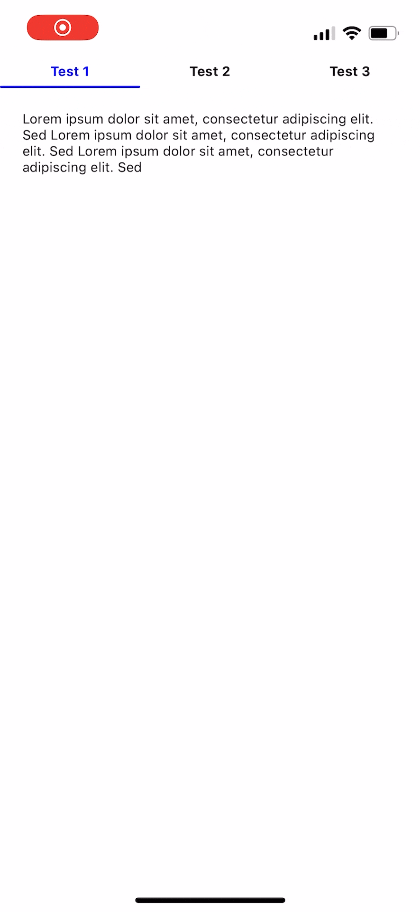

### React Native Tab Swipe



This module allows you to easily add tab-based navigation to your React Native app with the ability to switch tabs by swiping or by pressing on a tab.

## Usage

To use react-native-tab-swipe in your app, you need to wrap your app's content with the `<TabSwipe>` component, here's a example.


```
const [tabIndex, setTabIndex] = useState(0)

...

<TabSwipe
  style={{ flex: 1 }}
  labels={['Test 1', 'Test 2', 'Test 3']}
  tabIndex={tabIndex}
  onTabChange={setTabIndex}
>
  <Text>
    Lorem ipsum dolor sit amet, consectetur adipiscing elit.
  </Text>
  <Text>
    Lorem ipsum dolor sit amet, consectetur adipiscing elit.
  </Text>
  <Text>
    Lorem ipsum dolor sit amet, consectetur adipiscing elit.
  </Text>
</TabSwipe>
```

The tabIndex state can be accessed by your application and mutated to programatically change the active tab.

## Props

### `children`
- optional
- type: `React.ReactNode`

The children elements to render inside the tab swiper. It can be any React element you want.


### `labels`

- required
- type: `string[]`

The labels to diplay in the header.

### `tabIndex`

- required
- type: `Number`

The current tab index of the module. By changing this input the active tab will change.

### `onTabChange`
 
- required
- type: `(tabIndex: number) => void`

Function that updates when the active tab is changed. Use this to update your active tab state.

### `style`

- optional
- type: `StyleProp<ViewStyle>`
- default: undefined

Used for overriding the container style.

### `highlightColor`

- optional
- type: `String`
- default: 'blue'

Sets the active tab bar's text color and indicator color.

### `textColor`

- optional
- type: `String`
- default: 'black'

Sets the not active tab bar's text color.

### `indicatorStyle`

- optional
- type: `StyleProp<ViewStyle>`
- default: undefined

Used for overriding the colored indicator's style.

### `barStyle`

- optional
- type: `StyleProp<ViewStyle>`
- default: undefined

Used for overriding the bar containing the colored indicator's style.


